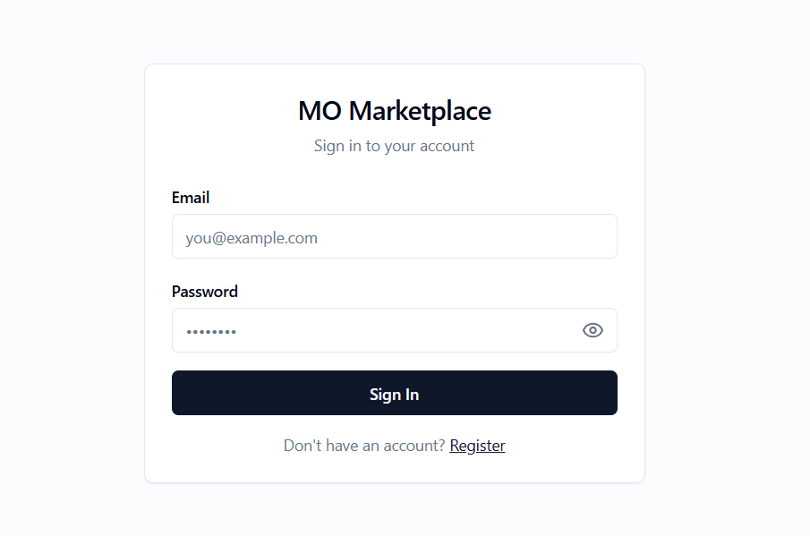
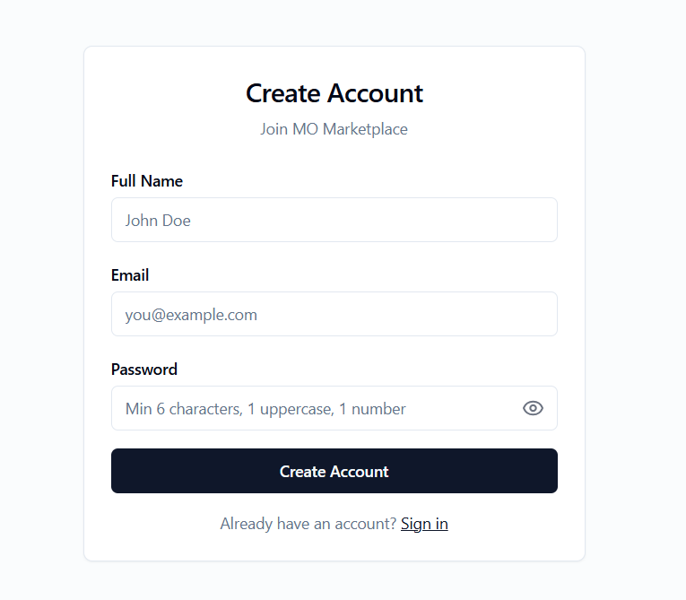
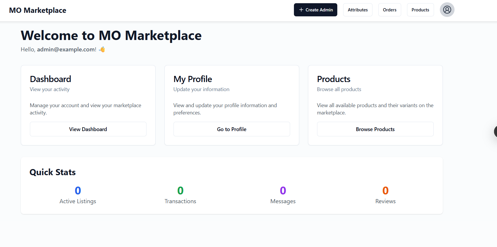
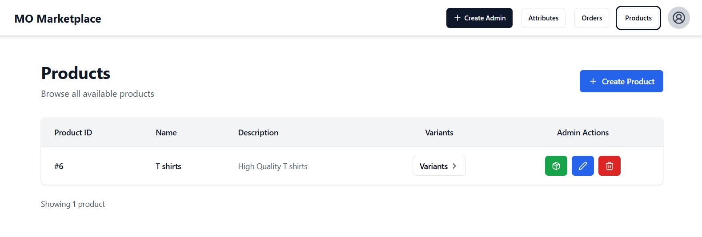
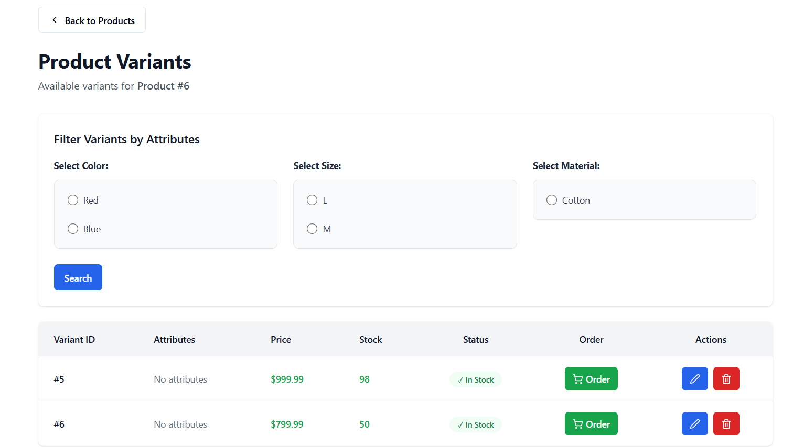
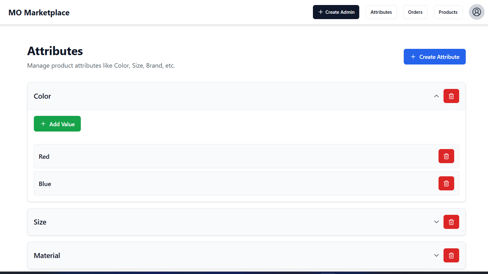
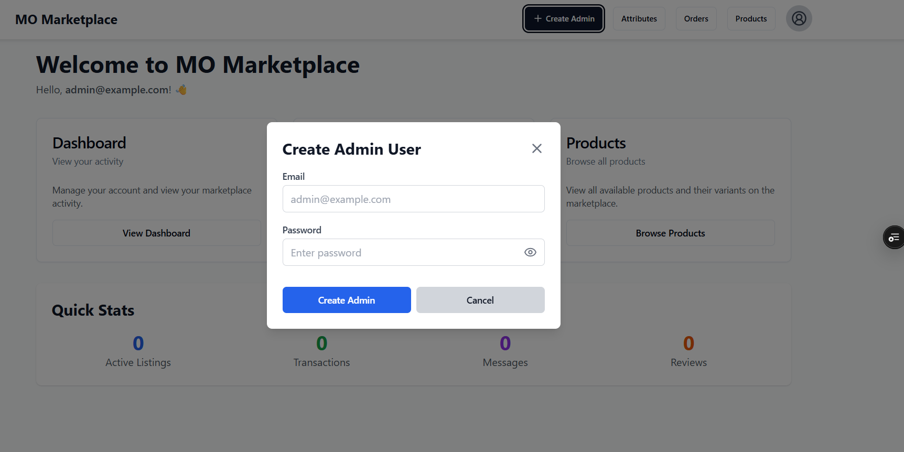
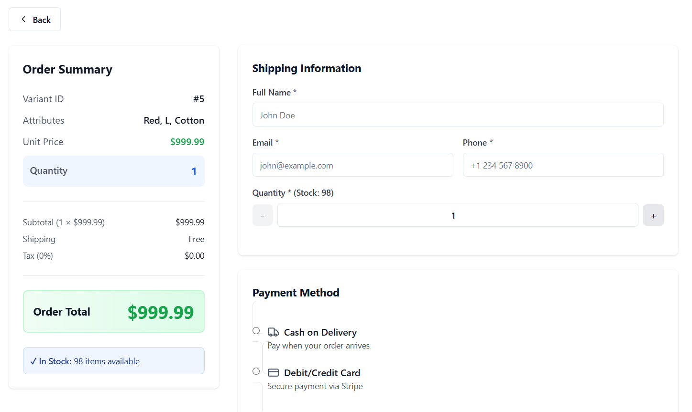
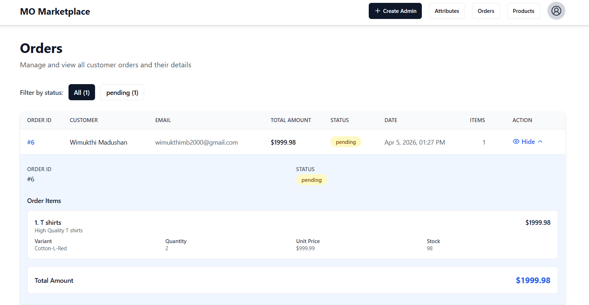
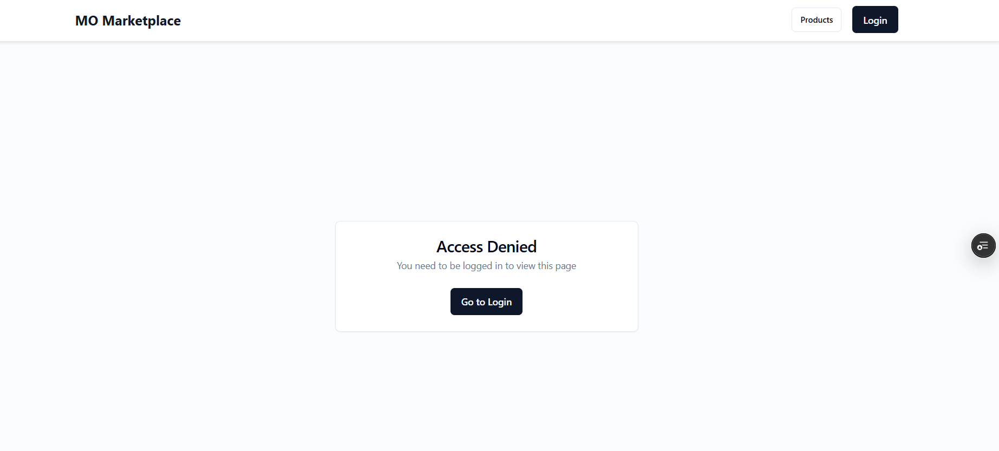

# MO Marketplace Frontend

A modern React + TypeScript e-commerce marketplace application built with Vite and styled with Tailwind CSS and Shadcn UI.

🌐 **Live Demo:** https://frontend-mo.vercel.app/

## Quick Start

### Prerequisites

- **Node.js** (v16 or higher)
- **npm** or **bun** package manager
- **Backend API** running (see Backend Setup below)

### Installation

1. **Clone the repository**

   ```bash
   cd Technical-Assessment-MO-Marketplace/Frontend
   ```

2. **Install dependencies**

   ```bash
   npm install
   # or
   bun install
   ```

3. **Configure API endpoint** (Optional)

   Edit `.env` file:

   ```env
   # Remote backend (default)
   VITE_API_BASE_URL=https://backend-mo-nrnd.onrender.com

   # Local backend
   # VITE_API_BASE_URL=http://localhost:3000
   ```

4. **Start development server**

   ```bash
   npm run dev
   # or
   bun run dev
   ```

5. **Open in browser**
   ```
   http://localhost:8080
   ```

---

## Screenshots

### Login Page



### Register Page



### Home Page



### Products Page



### Product Variants



### Setup Attributes (Admin)



### Create Admin (Admin)



### Make Order / Checkout



### View Orders



### First Page Intro



---

## Features

- **User Authentication** - Login & Registration with validation

- **Product Browsing** - View all marketplace products

- **Variant Filtering** - Filter by product attributes

- **Multiple Payment Methods** - COD & Card payment
- **Order Management** - View order history
- **Admin Dashboard** - Create/Edit/Delete products & variants (admin only)
- **Form Validation** - Real-time error messages
- **Responsive Design** - Works on mobile, tablet, desktop

---

## Technology Stack

- **Frontend Framework:** React 18
- **Build Tool:** Vite
- **Language:** TypeScript
- **Styling:** Tailwind CSS
- **UI Components:** Shadcn UI
- **State Management:** React Context
- **HTTP Client:** Axios
- **Testing:** Vitest & Playwright
- **Form Validation:** React Hook Form

---
